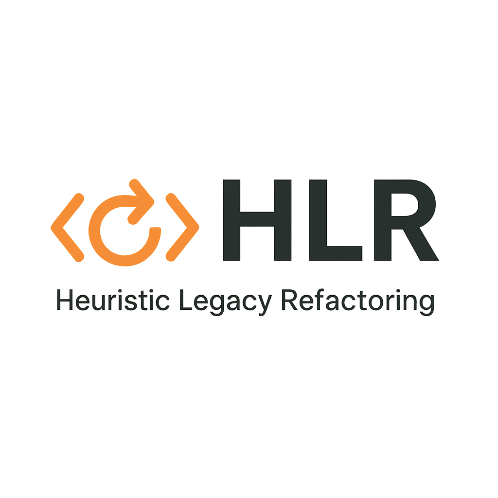

  

# Manifiesto Heuristic Legacy Refactoring (HLR)

## ¿Qué es HLR?  
**Heuristic Legacy Refactoring (HLR)** es un enfoque para modernizar sistemas heredados que combina **heurísticas**, **métricas objetivas** y **refactorización estratégica**.  
El objetivo es **reducir la deuda técnica**, **mejorar la mantenibilidad** y **preparar los sistemas existentes para su evolución futura**, guiados por datos en lugar de intuiciones.  

---

## Principios de HLR  

1. **Evidencia sobre intuición**  
   Las decisiones de refactorización se basan en métricas cuantitativas (complejidad, acoplamiento, mantenibilidad) en lugar de percepciones vagas.  

2. **Iteración sobre reescritura**  
   Los sistemas heredados se mejoran paso a paso, reduciendo el riesgo, en lugar de desechar todo y comenzar de cero.  

3. **Mapear para entender**  
   Todo proceso comienza con una evaluación clara del sistema: dependencias, puntos críticos, deuda técnica acumulada.  

4. **Refactorizar para modernizar**  
   La refactorización no es un fin en sí misma, sino un medio para permitir la evolución tecnológica y arquitectónica.  

5. **Sostenibilidad a largo plazo**  
   La deuda técnica debe medirse y gestionarse continuamente para evitar volver a sistemas inmantenibles.  

---

## Valores de HLR  

- **Claridad sobre complejidad**  
  Favorecer sistemas simples con responsabilidades claras y límites bien definidos.  

- **Datos sobre opiniones**  
  Confiar en métricas objetivas como brújula para refactorizar.  

- **Progreso incremental sobre grandes saltos**  
  La modernización paso a paso genera confianza y brinda resultados visibles.  

- **Colaboración sobre decisiones aisladas**  
  El conocimiento del sistema es compartido, y la refactorización debe involucrar a todo el equipo.  

- **Evolución continua sobre modernización puntual**  
  El objetivo no es un único hito sino una práctica sostenida que mantenga el software vivo y adaptable.  

---

## Beneficios de aplicar HLR  

- Identificación de **puntos críticos** en el sistema antes de cambios mayores.  
- Priorización objetiva de qué refactorizar y en qué orden.  
- Reducción del riesgo de fallos durante la modernización.  
- Preparación gradual hacia arquitecturas más modulares, escalables y resilientes.  
- Fomento de una cultura de **mejora continua**.  

---

## Cómo comenzar con HLR  

1. **Analizar el sistema** usando herramientas heurísticas para identificar estructura y riesgos.  
2. **Recolectar métricas clave**: complejidad, acoplamiento, deuda técnica.  
3. **Identificar puntos críticos**: los componentes que concentran el mayor riesgo.  
4. **Refactorizar en ciclos cortos**: simplificar, reducir dependencias, extraer responsabilidades.  
5. **Integrar métricas en CI/CD** para medir progreso y mantener el rumbo.  

---

Inspirado por la necesidad de modernizar sistemas heredados de una manera que sea **inteligente, medible y sostenible**.  
